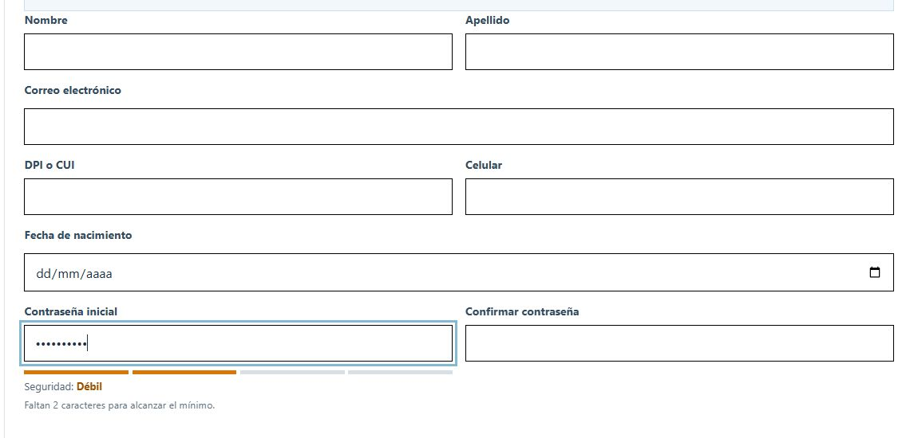

# QA de diseño — 30 de septiembre de 2026

## Resultado

Corregida la desalineación entre «Contraseña inicial» y «Confirmar contraseña». El indicador de seguridad conserva su espacio al pasar de vacío a muy débil, débil, normal y segura, sin estirar el campo contiguo ni desplazar los siguientes controles.

### Correcciones comprobadas

- Alineación superior de las columnas de formularios administrativos; campos de contraseña con la misma altura.
- Agrupación de etiqueta, campo e indicador en registro, recuperación y perfil. En el perfil común, el indicador queda debajo de la contraseña nueva.
- Ayuda de contraseña sin textos duplicados y con espacio estable.
- Eliminación del desbordamiento horizontal del documento en pantallas de 320 px.
- Reportes: la tabla se desplaza dentro de su contenedor; botones de exportación y paginación ordenados en móvil. Las regiones de tablas se pueden enfocar con teclado.

## Verificación visual

| Pantalla | Tamaños revisados (ancho en px) | Resultado |
| --- | --- | --- |
| Registrar empleado | 1920, 1280, 768, 390, 320 | Campos de 45,97 px de alto. En escritorio/tableta, diferencia vertical de 0 px. En móvil se apilan y mantienen su posición al cambiar el indicador. |
| Registro y recuperación | 1280, 768 en registro, 390, 320 | Sin saltos del campo de confirmación ni desbordamiento horizontal. |
| Perfil de usuario común | 1920, 1280, 768, 390, 320 | Indicador bajo el campo correcto; organización en columnas o apilada según el ancho. |
| Nueva noticia | 390 | Campos legibles y organizados, sin desbordamiento del documento. |
| Nuevo evento, grupos y requisitos | 1280, 768, 390, 320 | Sin desbordamiento del documento; se revisaron campos dinámicos sin guardar. |
| Áreas, contenido institucional, solicitudes, reportes, auditoría y configuración de página principal | 1280, 390, 320 | Revisión de las vistas principales y sus límites horizontales. |
| Nuevo trámite, pasos 1–3 | 320 | Diálogo con desplazamiento vertical; campos y botones accesibles. Se descartó el borrador sin crearlo. |

Medición final del reporte a 320 px: desbordamiento del documento **0 px**; tabla de 634 px dentro de una región desplazable de 237 px. Ambos botones de paginación miden 44 px de alto y están alineados.

El perfil común se inspeccionó con una respuesta simulada en el navegador y datos ficticios; no se cambió la cuenta del administrador. Las pestañas temporales de esa comprobación ya no están abiertas.

## Comprobaciones del proyecto

- `npm run revisar`: correcto.
- Pruebas de registro, perfil, recuperación, administración de usuarios y reportes: **5 archivos, 15 pruebas correctas**.
- `npm run compilar`: correcto. Vite informa de un paquete JavaScript mayor de 500 kB; es una advertencia de tamaño, no un fallo de compilación ni de diseño.

## Evidencias

## Alcance y límites

Esta revisión se concentra en distribución, alineación, comportamiento adaptable y estabilidad visual. No certifica todos los flujos funcionales ni sustituye pruebas de accesibilidad completas o en otros motores de navegador. No se crearon cuentas, noticias, eventos ni trámites, y no se enviaron cambios de contraseña. Se usaron valores ficticios únicamente en formularios sin guardar.
